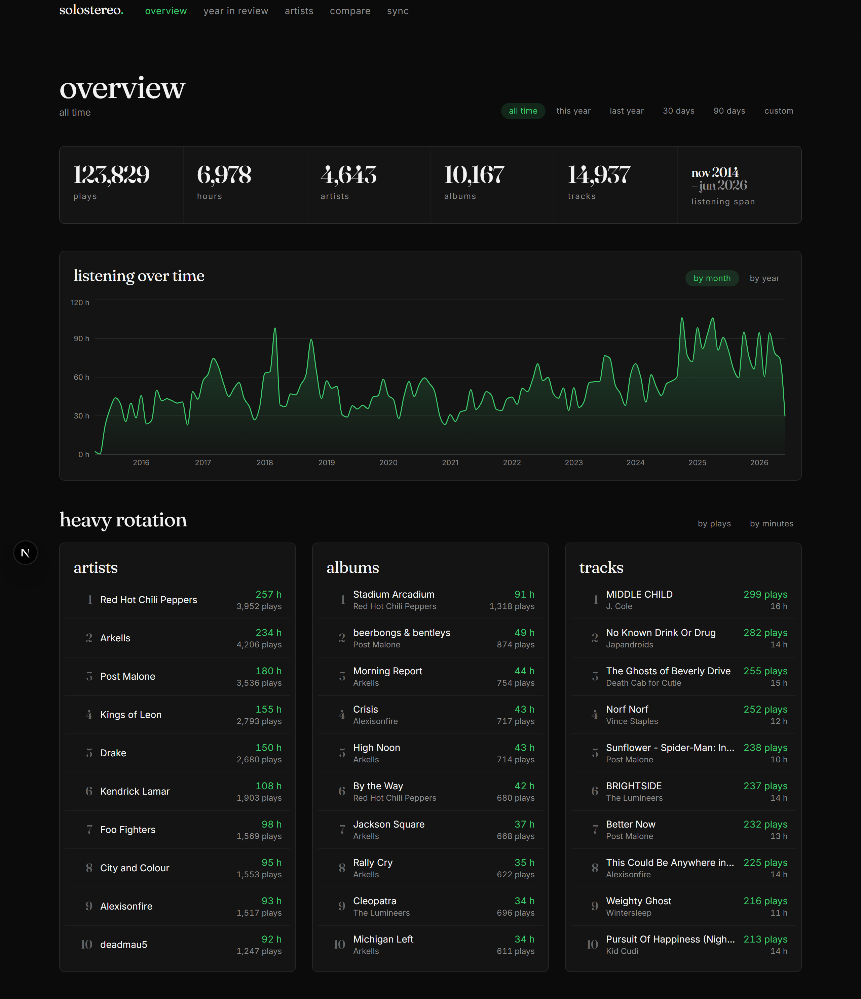
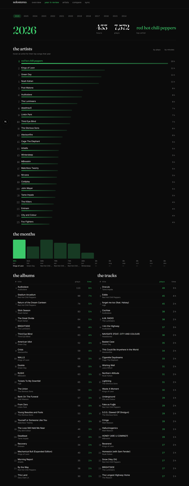
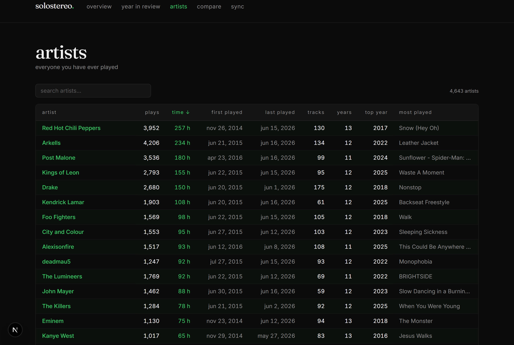
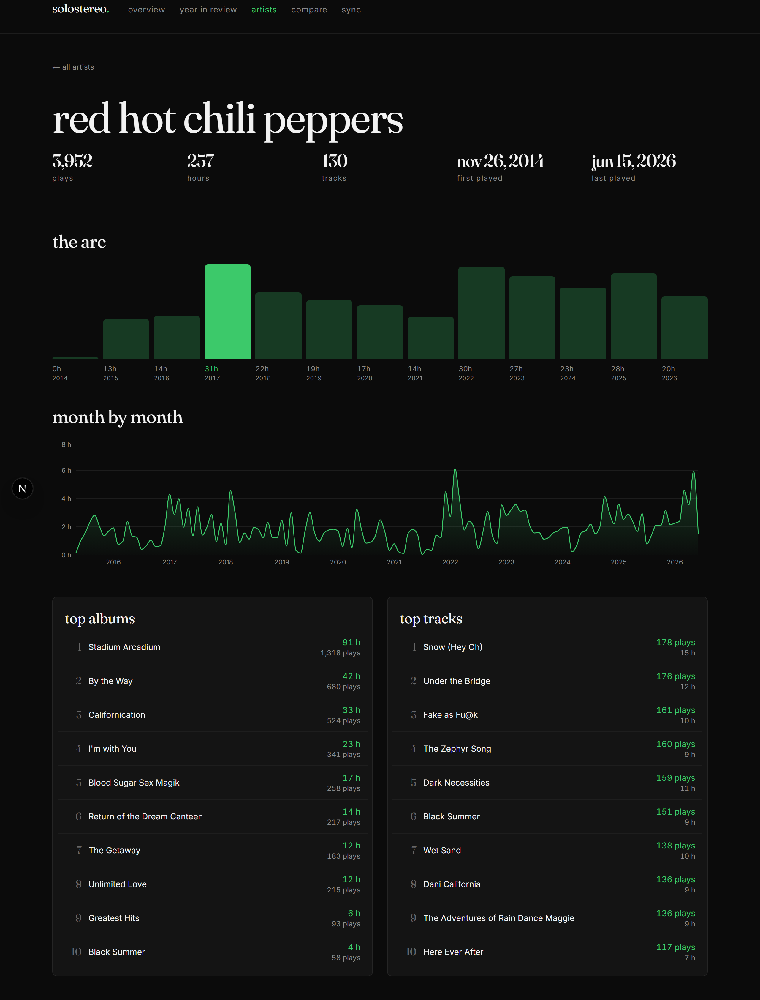
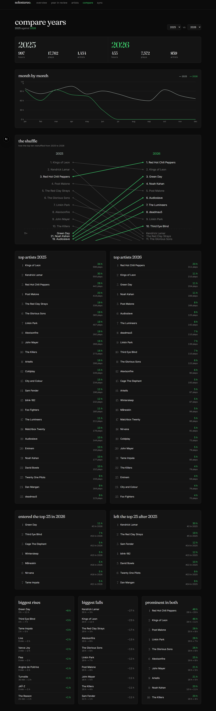
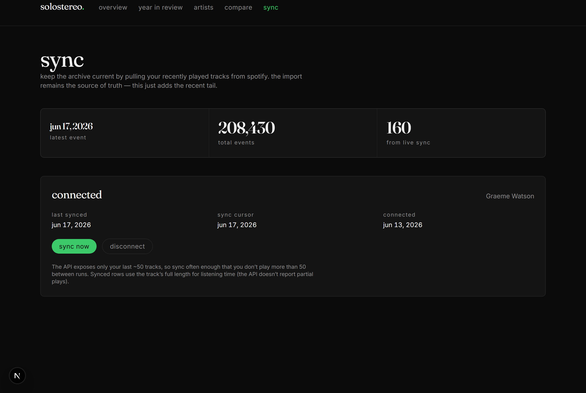

# solostereo

A personal Spotify listening archive — a local web app for exploring a decade
of Extended Streaming History as a beautiful, browsable artifact.

## Screens

> Shown with real listening history. Regenerate these from your own data with
> `npm run screenshots` (see [scripts/screenshots.ts](scripts/screenshots.ts)).

**Overview** — the landing dashboard: all-time vitals, a filterable
listening-over-time chart, and your most-played artists, albums, and tracks.



**Year in review** — a Wrapped-style recap for any year: top artist, hours and
plays, and that year's top 25 artists ranked (hover one for its top songs).



**Artists** — every artist you've ever played, with instant client-side search
and sortable columns.



**Artist detail** — one artist's whole story: "the arc" of listening year by
year, a month-by-month trend, and their top albums and tracks.



**Compare** — two years head to head: stat blocks, a monthly overlay, and a
slopegraph of how your top ten reshuffled.



**Sync** — the live-sync panel: connection status, event counts, and a manual
sync.



## Setup

Requirements: Node 20+ (developed on Node 24). No Docker, no external
services.

```bash
npm install
npm run migrate     # creates data/solostereo.db and applies db/migrations/*.sql
npm run dev         # then open http://127.0.0.1:3000 (not localhost — see below)
```

> **Open the app at `http://127.0.0.1:3000`, not `localhost:3000`.** The Spotify
> OAuth redirect URI uses `127.0.0.1`, and the login state cookie is host-scoped
> — connecting from `localhost` drops the cookie and fails with
> `error=state_mismatch`. Everything else works on either host, but `127.0.0.1`
> is the one that won't bite you when you connect Spotify.

Copy `.env.example` to `.env.local` if you need to override defaults (the
database path; Spotify OAuth keys are only needed for the future live
integration).

### Importing your listening history

Request the **Extended Streaming History** export from Spotify
(Privacy Settings → Download your data; it arrives as a zip after a few
days). Place the JSON files (`Streaming_History_Audio_*.json` **and**
`Streaming_History_Video_*.json` — video files share the schema and
occasionally contain real events) in `data/raw/spotify/`, then:

```bash
npm run import                  # imports data/raw/spotify/
npm run import -- <dir|file>    # or another directory / a single file
```

The importer is idempotent — rerunning it never duplicates records. Each
record gets a deterministic SHA-256 dedup hash (timestamp + URIs + names +
ms_played) with a database `UNIQUE` constraint and `INSERT OR IGNORE`, so
safety is enforced by the schema, not importer logic. The export itself
contains a handful of exact-duplicate rows; these are also collapsed.

**Reading the import summary.** After every run the importer prints per-file
counts, a summary, and runs `npm run validate` automatically:

- `raw rows read / rows inserted / duplicates skipped` — on a first import,
  inserted ≈ read (minus in-export duplicates). On a repeat import, inserted
  is 0 and every row counts as a duplicate — that is the idempotency proof.
- `music / podcast / audiobook rows` — every row is kept; podcasts and
  audiobooks are simply excluded from music analytics by a view.
- `music rows w/o artist / track` — rare export rows with missing metadata;
  they are preserved but excluded from rankings.
- `earliest / latest event, total listening hours` — quick sanity check that
  the date span and volume match what you expect.

## Live Spotify sync (optional)

The import is the authoritative record, but it lags by however long ago you
last downloaded it. The **sync** page (`/sync`) keeps the archive current by
pulling your recently played tracks straight from the Spotify Web API and
merging them into `listening_events` with the same dedup mechanism — so the
live sync and a future re-export can never double-count the same play.

**Limitations to know first:** the Web API only exposes your **last ~50
tracks** (there is no full-history endpoint), and it does not report how long
each track was listened to. So: sync often enough that you don't play more
than 50 tracks between runs, synced rows use the track's full length for
listening time, and synced rows are tagged `source_filename = 'spotify-api'`
so they stay distinguishable from the export. Podcasts aren't returned by this
endpoint — they still come only from the export.

### One-time setup

1. Go to the [Spotify Developer Dashboard](https://developer.spotify.com/dashboard)
   and **Create app** (any name/description; it can be in development mode —
   no review needed for personal use).
2. In the app's **Settings → Redirect URIs**, add this value **exactly**:

   ```
   http://127.0.0.1:3000/api/spotify/callback
   ```

   Spotify requires a loopback IP (`127.0.0.1`), not `localhost`, for `http`
   redirect URIs. If you run the app on a different port, change `3000` here
   and in `SPOTIFY_REDIRECT_URI` to match.
3. Copy the app's **Client ID** and **Client secret** (under Settings).
4. Create `.env.local` in the project root (copy from `.env.example`) and fill
   in:

   ```
   SPOTIFY_CLIENT_ID=your_client_id
   SPOTIFY_CLIENT_SECRET=your_client_secret
   SPOTIFY_REDIRECT_URI=http://127.0.0.1:3000/api/spotify/callback
   ```
5. Restart the dev server (`npm run dev`) so it picks up the new env vars.

### Connecting and syncing

1. Open the app at **`http://127.0.0.1:3000`** (use `127.0.0.1`, not
   `localhost`, so the OAuth redirect matches) and go to **sync** in the nav.
2. Click **connect spotify**, approve the read-only access request, and you'll
   land back on the sync page showing your account.
3. Click **sync now** whenever you want to pull the latest plays. The result
   line shows how many tracks were fetched, how many were new, and how many
   were already in the archive. Tokens refresh automatically; **disconnect**
   forgets them (your synced rows stay).

### Automatic syncs (headless)

After the one-time connect, `npm run sync` runs the same sync from the command
line with no browser — it reuses the stored refresh token. Because the
database and tokens live on this machine, schedule it with a **local**
scheduler (Windows Task Scheduler), not a cloud cron — a cloud job can't reach
your local DB.

Schedule **`scripts\sync-hidden.vbs`** via `wscript.exe` — it launches the sync
with no visible window, so a scheduled run never pops a console or steals focus
from a fullscreen app/game. (`scripts\sync.cmd` does the same thing but shows a
console window; use it for manual runs, not the scheduler.) Both cd to the
project, run the sync, and append to `data\sync.log`.

Run it **more often than once a day** — the API only keeps your last ~50
tracks, so on a heavy listening day a daily sync can still miss plays. Every 6
hours is a safe, cheap cadence (one API call per run). Example, registering an
every-6-hours hidden task:

```powershell
$action  = New-ScheduledTaskAction -Execute "wscript.exe" `
             -Argument '"C:\CursorFiles\SoloStereo\scripts\sync-hidden.vbs"'
$trigger = New-ScheduledTaskTrigger -Once -At (Get-Date).Date `
             -RepetitionInterval (New-TimeSpan -Hours 6)
Register-ScheduledTask -TaskName "solostereo-sync" -Action $action -Trigger $trigger `
  -Description "Sync recent Spotify plays into solostereo"
```

For a fully background task that also runs when logged out, add a principal
with `-LogonType S4U` (no stored password). Remove the task later with
`Unregister-ScheduledTask -TaskName "solostereo-sync"`.

> **Currently registered on this machine** (as of 2026-06-28): task
> `solostereo-sync` runs **every 6 hours** (4×/day) at **10:30 AM, 4:30 PM,
> 10:30 PM, and 4:30 AM** local time, anchored to a start date of 2026-06-13.
> The 4:30 PM run deliberately falls in the middle of the heavy daytime
> listening window so that window gets multiple runs rather than one long gap.
> It runs as user `wgrae` via `sync-hidden.vbs`. Inspect or change the interval
> without re-creating the task:
>
> ```powershell
> # view
> (Get-ScheduledTask -TaskName 'solostereo-sync').Triggers[0].Repetition.Interval
> # change cadence (e.g. to every 4 hours)
> $t = Get-ScheduledTask -TaskName 'solostereo-sync'
> $t.Triggers[0].Repetition.Interval = 'PT4H'
> Set-ScheduledTask -TaskName 'solostereo-sync' -Trigger $t.Triggers
> ```
Any gap larger than the ~50-track window can only be backfilled by
re-requesting the Extended Streaming History export and re-importing (the
dedup hash merges it with synced rows, no duplicates).

## Playlists — generate, review, push

The **playlists** page (`/playlists`) turns your listening history into
playlists you fully control before anything reaches Spotify: generate a draft
from a recipe, edit it in the app, then push it to your account.

**Recipes** (behaviour-only — no external metadata; see
[docs/metadata-sources-research.md](docs/metadata-sources-research.md) for the
deferred metadata decision):

- **Obsessions** — tracks you binged over a short stretch and then abandoned:
  a burst of plays in a rolling 30-day window that dominates the track's
  lifetime plays, followed by a long silence. Bucketed into one playlist per
  year ("Obsessions of 2018"). Keyed by Spotify track URI, so an abandoned
  version of a song is treated separately from a re-release you still play.
- **Lapsed loves** — tracks you played heavily long ago but haven't heard in
  18+ months. Ranked by lifetime plays weighted by how long they've been gone.

Every threshold (burst size, concentration, quiet window, size, per-artist
cap, …) is a tunable parameter on the generate form, with a live preview of
what the current settings would build.

**Review & edit.** A generated draft is saved locally (in the `playlists` /
`playlist_tracks` tables — your raw history is never touched). The editor lets
you rename it, set public/private, reorder tracks, exclude tracks (kept but
greyed out, not deleted), remove tracks, and add any track from your own
listening catalogue via search. Nothing is sent to Spotify until you press
**push**.

**Push to Spotify.** Pushing creates a playlist on your account (public by
default; toggle per-playlist) and adds your included tracks in order. Pushing
again *updates the same playlist* rather than creating a duplicate.

> **One-time reconnect.** The original sync connection only requested
> read-only access. Pushing playlists needs the `playlist-modify-public` and
> `playlist-modify-private` scopes, so the first time you'll see a "playlist
> push needs extra permission — reconnect spotify" notice on `/sync` (and on
> the playlist's push button). Click **reconnect spotify**, approve the new
> permissions, and the push button works from then on. Reconnecting keeps your
> synced history; it only adds the write scopes.

## Stack and rationale

- **Next.js (App Router) + TypeScript**, Tailwind CSS v4 + shadcn/ui restyled
  to the design system in [DESIGN.md](DESIGN.md).
- **SQLite via better-sqlite3**, plain SQL migrations in `db/migrations/`.
  Single user, ~300k rows, local-first: SQLite answers every query here in
  single-digit milliseconds with zero network hops and zero setup. A hosted
  Postgres was considered and rejected for v1 — remote round-trips would make
  every dashboard load feel slow.
- Raw imported history (`listening_events`) is kept separate from derived
  analytics (SQL views). Raw records are never deleted or silently dropped.

## Documented assumptions and tradeoffs

- **UTC bucketing.** Export timestamps are UTC and all date bucketing (days,
  months, years) is done in UTC. Late-evening local listening can land on the
  next UTC day/year. Decided 2026-06-12; there is deliberately no timezone
  configuration.
- **Artists are keyed by name string.** The export contains artist names but
  no artist URIs, so all artist-level analytics key on the name. An artist who
  changed display name appears as two artists. Accepted for v1.
- **`ip_addr` is deliberately dropped** at import time — privacy, and no
  analytical value. Every other export field is preserved.
- **Podcast and audiobook rows are preserved** in `listening_events` but
  excluded from music analytics by the `music_listening_events` view. Nothing
  is deleted.

## Metric definitions

- **Meaningful play (default play count everywhere):** a music event with
  `ms_played >= 30000`. The export logs every skip, including 2-second
  shuffle skips; raw event counts would pollute rankings with songs that were
  skipped past. 30 seconds matches how Spotify itself counts a stream, so
  totals roughly agree with Wrapped.
- **Raw play (secondary, available as a toggle):** any imported music event.
- **Listening time:** `ms_played / 60000` minutes (or `/ 3600000` hours),
  summing **all** events including sub-30-second ones.
- **Active year:** an artist is active in a year when at least one music
  event exists for that artist in that calendar year (UTC).
- **Rankings:** artists and albums default to listening minutes; tracks
  default to meaningful plays. Both orderings are available.

## Project layout

```
app/              Next.js App Router pages (overview, year, artists, compare,
                  playlists) and route handlers under app/api/
components/       bespoke components; components/ui/ is shadcn-generated
db/migrations/    plain SQL migrations, applied in filename order
lib/              shared code: db connection, query layer (queries.ts),
                  playlist recipes (recipes.ts), playlist CRUD (playlists.ts)
scripts/          migrate / import / validate / recipe-preview / smoke CLI scripts
data/             SQLite db + raw export (gitignored — personal data)
docs/             screenshots + metadata-sources research
plan.md           project plan and single source of truth for status
DESIGN.md         binding design system
```

## Validation

`npm run validate` (from Phase 1) runs every data-quality check against the
live database and exits non-zero on any failure — importer idempotency,
no negative `ms_played`, yearly totals reconciling to all-time totals,
summary views reconciling to raw events, podcast/audiobook exclusion
from music views, and (check 9) that every track in a generated playlist
references a real event in `listening_events`. It is the mechanical
definition of done for data tasks.
